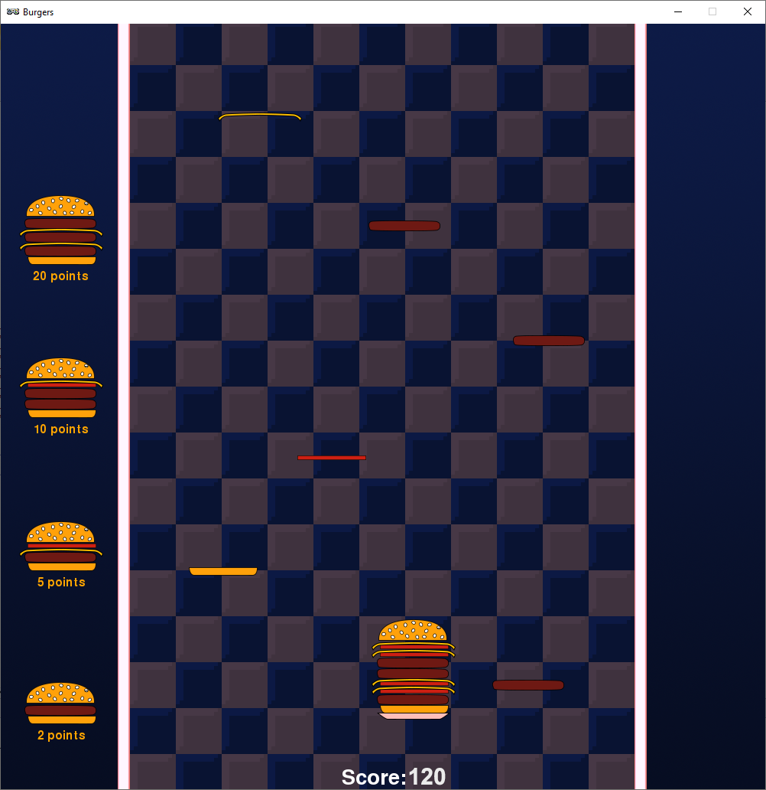

.. pygamezero_burgers documentation master file, created by
   sphinx-quickstart on Fri Jan 22 07:52:42 2021.
   You can adapt this file completely to your liking, but it should at least
   contain the root `toctree` directive.

Pygame Zero : Burgers Game
===========================================

https://tinyurl.com/pgzburgers

In this tutorial we'll make a game about catching falling ingredients and building burgers!

If you're just starting out with Python you should start with the `Flappy Bird Tutorial <https://pygamezero-bird.readthedocs.io/en/latest/?>`_.

This tutorial will assume you've already completed the Flappy Bird tutorial so this time we'll skip some of the really basic stuff.  

Getting Started
---------------
Check the beginning of the `Flappy Bird Tutorial <https://pygamezero-bird.readthedocs.io/en/latest/?>`_ for instructions on installing Mu.  

Important tip for using Mu
--------------------------
The first time you save your work in Mu it will open the save dialog in a folder called mu_code.  It's important you save in that exact folder.  If you don't Mu won't be able to run your games. 

Installing Burger Images
------------------------
- Download the tutorial assets by |location_link|. You can close that page once the download finishes.  

- Click on the **Images** button in the Mu editor.  This will open the directory where Pygame Zero looks for images.  

- Copy the burgers folder from the **images.zip** file you just downloaded into this directory.

.. |location_link| raw:: html

   <a href="https://kinolien.github.io/gitzip/?download=https://github.com/andyborrell/pygamezero_burgers/tree/master/images" target="_blank">clicking this link</a>

Start the Tutorial
------------------

Click on the Part 1 link below to get started.

.. toctree::
   :maxdepth: 1

   part1

