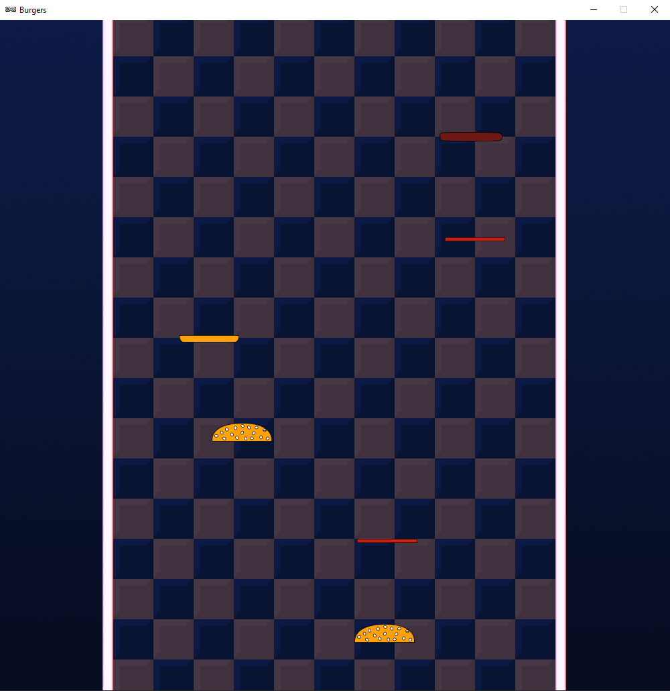

.. _part1:

Part 1
======

Getting Started
---------------
To start our project let's start a new file and enter the following lines:

.. code-block:: python

    TITLE = "Burgers"
    WIDTH = 1000
    HEIGHT = 1000

When it's a good time to test your code you will see this icon:

.. image:: images/play_icon.png

When you see this icon you can hit the **Play** button in Mu to start your game.  If you can't see the button you might need to press **stop** first.

Go ahead and press **play** now.  You should see an empty black window.  Now let's add a background.

Add these lines to the end of your file:

.. code-block:: python

    def draw():
        screen.blit("burgers/background",(0,0))

.. image:: images/play_icon.png

There's the play icon again.  Hit **play** and you should now see the Burgers background.  If this worked you can jump ahead to Ingredients List.   If you got an error read on for tips on fixing it:

Errors (Skip if you don't have an error)
----------------------------------------

The first thing to check is that you downloaded the required images for this project.  See the Getting Started section for details on this.  You can check your images are in the right place by clicking on the **Images** button in Mu.  This will open the images folder, you should have put the burgers folder inside this folder.

The second problem you might have is if you saved your code file in a custom location.  Unfortunately Mu only likes code files that are saved in its mu_code directory.  This is the directory that is one level above the images directory that opens up when you click **Images**.

    

Ingredients List
----------------
In this project we're going to create our own **class** called GameData.  We've already used classes in the Flappy Bird tutorial.  When you typed :code:`barry_the_bird = Actor...` you were using the Actor class.  

A class is kind of like a blueprint for an object.  Each class makes its own type of object.  The Actor class makes objects that we can draw and move around on the screen, like a Sprite in Scratch.  

Type the following at the end of your code to create a new class called :code:`GameData`.

.. code-block:: python

    class GameData:
        pass

    game = GameData()

Remember that indendation (number of spaces at the beginning of the line) matters in Python!

The first two lines make the simplest class you can possibly have, with nothing in it!  The :code:`game = GameData()` line creates an object from this class.  Classes are normally more complicated than this, but to keep things simple we'll start with an empty class and just add stuff to it as we go.

Next add the following lines to the end of your file:

.. code-block:: python

    def start_game():
        game.items = []
        clock.schedule(spawn_item, 1)
        
    def spawn_item():
        new_item = Actor("burgers/bun_top", (500, 100))
        game.items.append(new_item)

    start_game()

What did we just add?  

We added function called :code:`start_game`, and a function called :code:`spawn_item`, these are functions we're adding so we could have called them anything we want. The :code:`start_game` function does two interesting things:

.. code-block:: python
    :emphasize-lines: 1

    game.items = []

The [] symbols make a list, and there's nothing inside the [] so it's an empty list!  We'll add some items to it soon.  This whole line means we're creating a list variable called :code:`items` in our :code:`game` object.  The :code:`game` object is where we're going to keep all of our game variables.

.. code-block:: python
    :emphasize-lines: 1

    clock.schedule(spawn_item, 1)

This line uses the **clock.schedule** function which is part of Pygame Zero.  It says that we would like the :code:`spawn_item` function to be called :code:`1` second later.  We use this make a delay.

The next function we just added is the :code:`spawn_item` function.  This is the function we just told **clock.schedule** to call!  Let's look at what it does:

.. code-block:: python
    :emphasize-lines: 1

    new_item = Actor("burgers/bun_top", (500, 100))

This line creates a new :code:`Actor`, just like we did in Flappy Bird.  We use a variable called :code:`new_item` to hold it.

.. code-block:: python
    :emphasize-lines: 1

    game.items.append(new_item)

This adds the new :code:`Actor` we just created to the list we created in the :code:`start_game` function.

.. code-block:: python
    :emphasize-lines: 1

    start_game()

Finally this is the line that will actually start the game!  

+----------------------------------------------------------------------------------------------------+
| Make sure start_game() is always the last line of the file                                         |   
+----------------------------------------------------------------------------------------------------+

We won't see anything different yet, but go ahead and check that your code still runs ok:

.. image:: images/play_icon.png

To give us something to see we need to add these highlighted lines to the draw function:

.. code-block:: python
    :emphasize-lines: 3-4

    def draw():
        screen.blit("burgers/background",(0,0))
        for item in game.items:
            item.draw()

The **for** keyword is a way to make a loop.  In this loop were going take every :code:`item` in our :code:`game.items` variable and then draw the :code:`item`.

.. image:: images/play_icon.png

Now you should see that after one second a part of a burger appears on the screen!

Let's add an update function to make this sprite fall down the screen:

.. code-block:: python

    def update():
        for item in game.items:
            item.y += 5

We're using **for** again to loop over all the items in our list.  There's only one item in the list so far, but we can change that now. Add this line to end of your :code:`spawn_item` function:

.. code-block:: python
    :emphasize-lines: 4

    def spawn_item():
        new_item = Actor("burgers/bun_top", (500, 100))
        game.items.append(new_item)
        clock.schedule(spawn_item, 0.5)

This means that everytime an item spawns we schedule another to be spawned again in 0.5 seconds.

.. image:: images/play_icon.png

Now you should see a trail of burger tops streaming down the screen.

Mix It Up!
----------

Next we're going to randomize which ingredients fall down and the screen and we'll make it so they're not all in the center.

Add these highlighted lines to the top of your file:

.. code-block:: python
    :emphasize-lines: 1,7-10

    import random

    TITLE = "Burgers"
    WIDTH = 1000
    HEIGHT = 1000

    SPAWN_ITEM_INTERVAL = 0.5
    ITEM_X_MIN = 250
    ITEM_X_MAX = 750
    FALL_SPEED = 5

Can you guess why what these lines are for?  

First let's change our :code:`start_game` and :code:`spawn_item` functions to use the new :code:`SPAWN_ITEM_INTERVAL` variable.  We can also change the :code:`update` function to use :code:`FALL_SPEED`. The highlighted lines are the lines you need to change:

.. code-block:: python
    :emphasize-lines: 3,8,12

    def start_game():
        game.items = []
        clock.schedule(spawn_item, SPAWN_ITEM_INTERVAL)

    def spawn_item():
        new_item = Actor("burgers/bun_top", (500, 100))
        game.items.append(new_item)
        clock.schedule(spawn_item, SPAWN_ITEM_INTERVAL)

    def update():
        for item in game.items:
            item.y += FALL_SPEED

This means we have one convenient place at the top of the file to tweak the game.

.. image:: images/play_icon.png

- What happens if you set :code:`FALL_SPEED` to 50?
- What happens if you set :code:`SPAWN_ITEM_INTERVAL` to 0.001?
- When you're done experimenting set :code:`FALL_SPEED` back to 5 and :code:`SPAWN_ITEM_INTERVAL` back to 0.5

Next let's create a list of image filenames so that we can pick at random which to use.  Add these highlighted lines after your constants at the top of your file:

.. code-block:: python
    :emphasize-lines: 4-10

    ITEM_X_MAX = 750
    FALL_SPEED = 5

    NUM_ITEM_TYPES = 5
    item_images = ["burgers/bun_bottom",
                   "burgers/bun_top",
                   "burgers/meat",
                   "burgers/cheese",
                   "burgers/tomato"
                   ]

Remember the [] from before?   Well here they are again, but this time there are 5 items in the list, each one is the file path to an image we want to use.

Next, change our :code:`spawn_item` function so it picks one of the random images (you need to change the highlighted lines):

.. code-block:: python
    :emphasize-lines: 2-3

    def spawn_item():
        item_type = random.randint(0, NUM_ITEM_TYPES-1)
        new_item = Actor(item_images[item_type], (500,100))
        game.items.append(new_item)
        clock.schedule(spawn_item, SPAWN_ITEM_INTERVAL)

Now when we create the Actor we're using an image from our :code:`item_images` list.  The code that selects an image is :code:`item_images[item_type]`, this time the [] are not creating a new list, they're accessing part of a list we already have.  

+--------------------------------------------------------------------------------------------------------------------------------------------------------------------------------+
|In Python the [] symbols do two different things:                                                                                                                               |
|                                                                                                                                                                                |
|:code:`my_list = ["Cat", "Dog", "Parrot"]`                                                                                                                                      |                
|                                                                                                                                                                                |    
|:code:`print(my_list[1])`                                                                                                                                                       |
|                                                                                                                                                                                |
|On the first line they create a new list, and on the second line they're used to get item number one in the list.   Item one is Dog!  Lists start at zero in python.            |
+--------------------------------------------------------------------------------------------------------------------------------------------------------------------------------+

We use :code:`random.randint` to randomly choose a number between :code:`0` (the first image in the list), and :code:`NUM_ITEM_TYPES-1`,  the last item in the list.

- Can you figure out why we do :code:`NUM_ITEM_TYPES - 1` instead of just :code:`NUM_ITEM_TYPES`?

.. image:: images/play_icon.png

You should now have some random burger pieces falling down the screen.

Finally let's spread them out randomly from left to right.  Change this highlighted line in your :code:`spawn_item` function:

.. code-block:: python
    :emphasize-lines: 3

    def spawn_item():
        item_type = random.randint(0, NUM_ITEM_TYPES-1)
        new_item = Actor(item_images[item_type], (random.randint(ITEM_X_MIN, ITEM_X_MAX),100))
        game.items.append(new_item)
        clock.schedule(spawn_item, SPAWN_ITEM_INTERVAL)

Now we're using :code:`random.randint` again to pick a random starting x value for each item.  The second parameter to the Actor function is an (x,y) pair of numbers.  We're using our new call to :code:`random.randint` for the x value, and :code:`100` for the y value.

.. image:: images/play_icon.png

You should now game that looks something like this:

Served Up Next
--------------

In the next part we'll add a plate so we can catch the pieces and build some tasty burgers!

