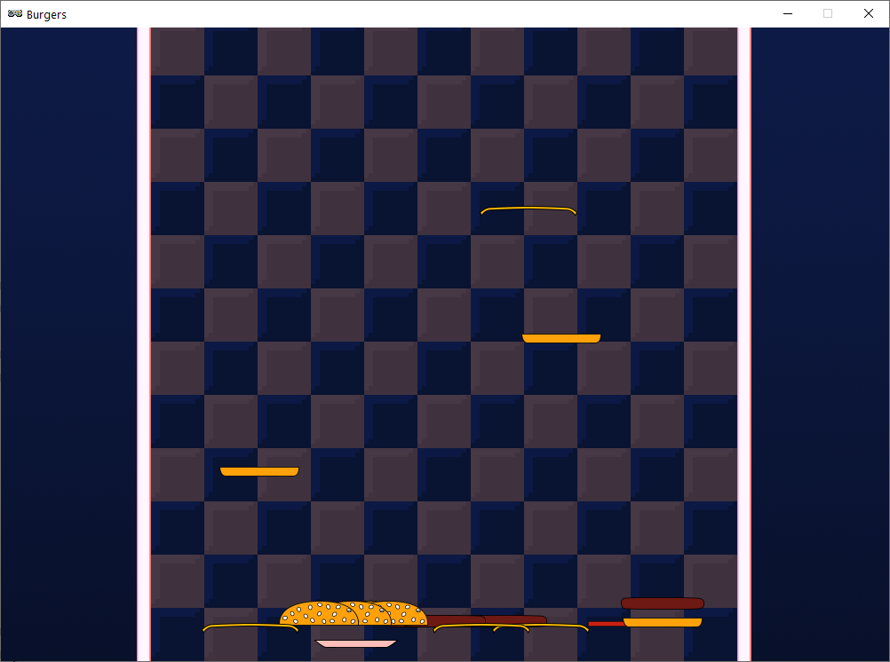
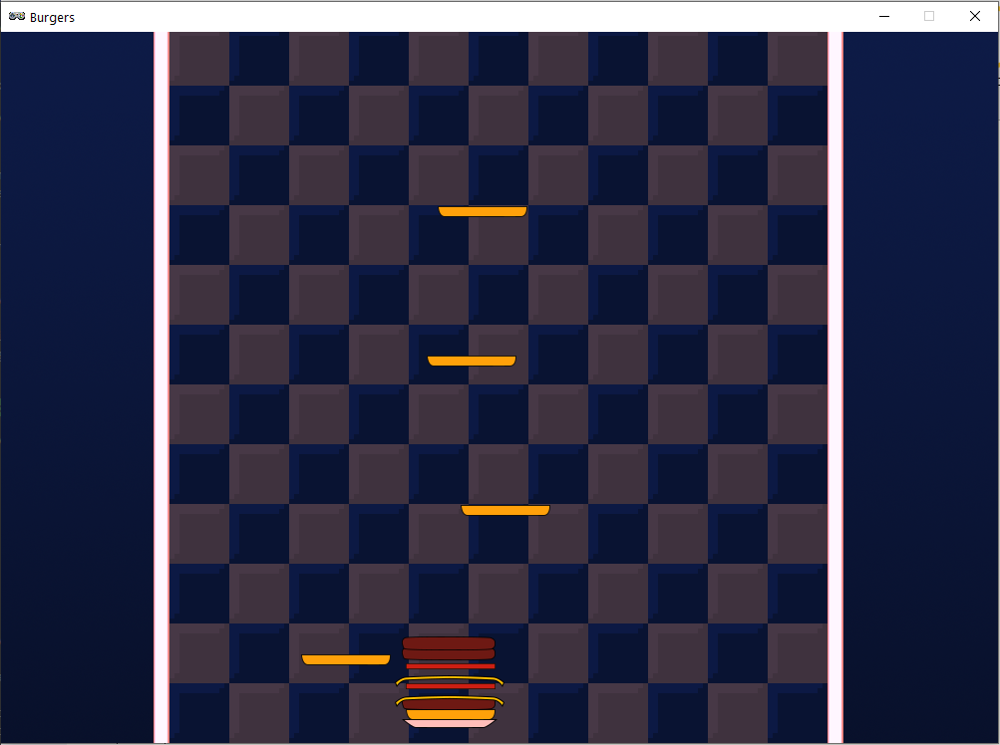
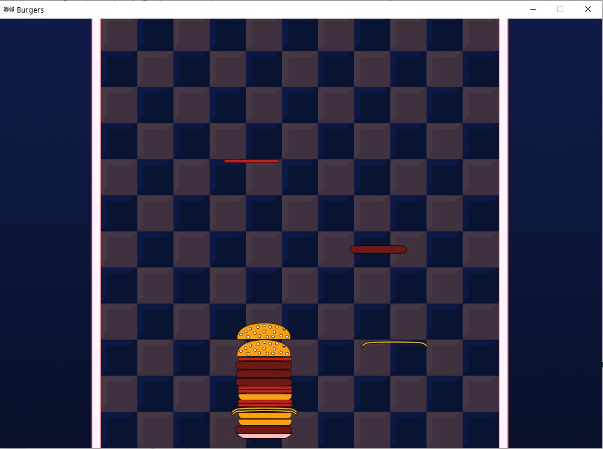

.. _part2:

.. role:: hidden
.. role:: beware

Part 2
==========================================================================

Tidying Up
----------

Before carrying on you might want to tidy your code up a bit.  It's generally OK to reorder functions and variable definitions to make things tidier and easier to understand.  Just make sure that variables and functions are defined **before** they are used.  

The first thing your program does is execute all the lines that are not inside a function, so if a variable or function is used outside of a function then it must be defined earlier in the file.  

If something is used **inside** a function then it has to be defined before the function is called.

Aside from some function reordering your code should look like this:

.. code-block:: python
    :emphasize-lines: 25,27,38,44

    import random

    TITLE = "Burgers"
    WIDTH = 1000
    HEIGHT = 714

    SPAWN_ITEM_INTERVAL = 0.5
    ITEM_X_MIN = 250
    ITEM_X_MAX = 750
    FALL_SPEED = 5

    NUM_ITEM_TYPES = 5
    item_images = ["burgers/bun_bottom",
                   "burgers/bun_top",
                   "burgers/meat",
                   "burgers/cheese",
                   "burgers/tomato"
                   ]
                   
    class GameData:
        pass

    game = GameData()

    def start_game():
        game.items = []
        clock.schedule(spawn_item, SPAWN_ITEM_INTERVAL)

    def draw():
        screen.blit("burgers/background",(0,0))
        for item in game.items:
            item.draw()

    def update():
        for item in list(game.items):
            item.y += FALL_SPEED

    def spawn_item():
        item_type = random.randint(0, NUM_ITEM_TYPES-1)
        new_item = Actor(item_images[item_type], (random.randint(ITEM_X_MIN, ITEM_X_MAX),100))
        game.items.append(new_item)
        clock.schedule(spawn_item, SPAWN_ITEM_INTERVAL)

    start_game()

Two examples of correct code ordering have been highlighted in the code above:

- :code:`start_game` is called outside of a function (on the last line), so the definition of :code:`start_game` has to be earlier in the file.  It is!
- :code:`spawn_item` is used inside the :code:`start_game` function, so it has to be defined before the :code:`start_game` function function is called. It is!

If you're wondering about the :code:`draw` and :code:`update` functions, these functions are part of Pygame Zero and won't be called until the whole file has been processed, so you can put these anywhere!

Now, let's get on with making burgers...

Adding a Plate
--------------

Add these highlighted lines to create and draw the plate **Actor**:

It doesn't matter if your **start_game** and **draw** functions are not in the same order as shown here.  It's just what's inside the functions that matters.

.. code-block:: python
    :emphasize-lines: 3,11

    def start_game():
        game.items = []
        game.plate = Actor("burgers/plate", (WIDTH/2, PLATE_Y))
        clock.schedule(spawn_item, SPAWN_ITEM_INTERVAL)

    def draw():
        screen.blit("burgers/background",(0,0))
        for item in game.items:
            item.draw()
        game.plate.draw()

You might have noticed that **PLATE_Y** doesn't exist yet.  Let's add a few new constants to the top of the file.  Just add the highlighted lines:

.. code-block:: python
    :emphasize-lines: 5-9 

    ITEM_X_MIN = 250
    ITEM_X_MAX = 750
    FALL_SPEED = 5

    PLATE_Y = 690
    PLATE_SPEED = 10
    CATCH_RANGE_X = 40
    CATCH_RANGE_Y = 20
    IMAGE_SIZE = 128
    
Can you guess what we'll be using these new values for?  We already know what PLATE_Y is for.

You should now see your plate at the bottom of the screen ready to catch falling ingredients. It won't move yet!

Now let's add these highlighted lines to the beginning of your **update** function so we can move the plate.

.. code-block:: python
    :emphasize-lines: 2-9

    def update():
        if (keyboard[keys.A] or keyboard[keys.LEFT]):
            game.plate.x -= PLATE_SPEED
        if (keyboard[keys.D] or keyboard[keys.RIGHT]):
            game.plate.x += PLATE_SPEED
        if (game.plate.x < ITEM_X_MIN):
            game.plate.x = ITEM_X_MIN
        if (game.plate.x > ITEM_X_MAX):
            game.plate.x = ITEM_X_MAX
        for item in list(game.items):
            item.y += FALL_SPEED

This is similar to code we've seen in Flappy Bird.  The first two **if** statements handle when you press the movement keys to move the plate left and right.  

- Can you figure out what the last four highlighted lines do?

| Select this box with your mouse to see the answer:
| :hidden:`They stop the plate moving too far left or right`

Catching Items
------------------------

You should now be able to move your plate left and right.  Now let's make it so that we can catch some ingredients.  The changes you need are in the highlighted lines below.  You're adding more code to the item loop in the update function.  Before, this loop was moving every item down the screen. Now it's also going to do a couple of checks on the position of the item.  

The first **if** checks to see if the item went off the bottom of the screen (do you remember this from Flappy Bird?), and the **elif** checks to see if the item is near enough to the plate to be caught by it.

In both cases we remove the item from :code:`game.items`.  When it's removed from the list it won't get drawn by the :code:`draw` function any more, so the item disappears!

.. code-block:: python
    :emphasize-lines: 13-17

    def update():
        if (keyboard[keys.A] or keyboard[keys.LEFT]):
            game.plate.x -= PLATE_SPEED
        if (keyboard[keys.D] or keyboard[keys.RIGHT]):
            game.plate.x += PLATE_SPEED
        if (game.plate.x < ITEM_X_MIN):
            game.plate.x = ITEM_X_MIN
        if (game.plate.x > ITEM_X_MAX):
            game.plate.x = ITEM_X_MAX
        
        for item in list(game.items):
            item.y += FALL_SPEED
            if (item.y > HEIGHT):
                game.items.remove(item)
            elif (abs(item.y - game.plate.y) < CATCH_RANGE_Y and
                  abs(item.x - game.plate.x) < CATCH_RANGE_X):
                game.items.remove(item)

You should be able to make items disappear by hitting them with your plate.

You haven't seen the **abs** function before.  It means absolute and you can use it stop a number being negative.  E.g.

- :code:`abs(-3) gives 3`
- :code:`abs(-100.5) gives 100.5`
- :code:`abs(45) gives 45`   <-- Positive numbers stay the same 

Can you see why we had to use the **abs** function in the code we just added?

The way these lines work is by looking at how far away the plate is from an item.  It checks both the x direction (left and right) and the y direction (up and down). 

It uses subtraction to find the difference between two values, and because we only care about how far away it is (the *absolute* distance) and not whether it up or down; or left or right of the plate, we use the **abs** function.   

The :code:`CATCH_RANGE_X` and :code:`CATCH_RANGE_Y` constants specify how for the item is allowed to be away from the plate in the x axis and the y axis. 

See what happens if you make the catch ranges bigger like this:

.. code-block:: python
    :emphasize-lines: 2-3

    PLATE_SPEED = 10
    CATCH_RANGE_X = 400
    CATCH_RANGE_Y = 200
    IMAGE_SIZE = 128

Don't forget to put them back:

.. code-block:: python
    :emphasize-lines: 2-3

    PLATE_SPEED = 10
    CATCH_RANGE_X = 40
    CATCH_RANGE_Y = 20
    IMAGE_SIZE = 128

---------------------------

Next we want these items we've caught to appear on the plate.  We have to write some code to draw them and to make them move when the plate moves.

First we'll create a list variable to contain items that are on the plate.  Add the highlighted line:

.. code-block:: python
    :emphasize-lines: 3

    def start_game():
        game.items = []
        game.plate_items = []
        game.plate = Actor("burgers/plate", (WIDTH/2, PLATE_Y))
        clock.schedule(spawn_item, SPAWN_ITEM_INTERVAL)

Remember that [] means an empty list.  

Next let's add every item we catch to this list.  Add the highlighted line to your update function:

.. code-block:: python
    :emphasize-lines: 8

    for item in list(game.items):
        item.y += FALL_SPEED
        if (item.y > HEIGHT):
            game.items.remove(item)
        elif (abs(item.y - game.plate.y) < CATCH_RANGE_Y and
              abs(item.x - game.plate.x) < CATCH_RANGE_X):
            game.items.remove(item)
            game.plate_items.append(item)

Of course we also need to draw this list of items.  

Can you figure out what to do to draw the items in the list?

Try to make this work on your own before scrolling down.  Don't worry that when you do draw the items they stay still and don't move with the plate.

-----

| .
| .
| Scroll down to see the solution...
| .
| .
| .
| .
| .
| .
| .
| .
| .
| .
| .
| .
| .
| .
| .
| Scroll some more...
| .
| .
| .

-----

Here's the solution.  Add the highlighted lines to draw these items on the plate.  

.. code-block:: python
    :emphasize-lines: 6,7

    def draw():
        screen.blit("burgers/background",(0,0))
        for item in game.items:
            item.draw()
        game.plate.draw()
        for item in game.plate_items:
            item.draw()

Is this everything we need to?  Try it and see if everything works...

Well, it looks like you stop items falling, but they don't move with the plate!  

We need to move these ingredient items every frame so they stay stick to the plate.  Remember we can put code we want to happen every frame in the **update** function.   

Here are some lines we can add to the end of the **update** function.  

:beware:`Beware!`  These lines have a bug in them!  Can you spot the bug and fix it?

As a clue remember that this code is supposed to set the position of each ingredient item to match the position of the plate.  

.. code-block:: python
    :emphasize-lines: 18-22

    def update():
        if (keyboard[keys.A] or keyboard[keys.LEFT]):
            game.plate.x -= PLATE_SPEED
        if (keyboard[keys.D] or keyboard[keys.RIGHT]):
            game.plate.x += PLATE_SPEED
        if (game.plate.x < ITEM_X_MIN):
            game.plate.x = ITEM_X_MIN
        if (game.plate.x > ITEM_X_MAX):
            game.plate.x = ITEM_X_MAX
        for item in list(game.items):
            item.y += FALL_SPEED
            if (item.y > HEIGHT):
                game.items.remove(item)
            elif (abs(item.y - game.plate.y) < CATCH_RANGE_Y and
                  abs(item.x - game.plate.x) < CATCH_RANGE_X):
                game.items.remove(item)
                game.plate_items.append(item)
        game.stack_height = 0
        for item in game.plate_items:
            item.y = game.plate.y - game.stack_height
            item.x = game.plate.y
            game.stack_height += 10

.. raw:: html

    Select this box with your mouse to see the solution: 
    <table class="hidden"><tr><td>
    The line that starts with <b>item.x</b> should be  <b>item.x = game.plate.x</b>   That's an <b>x</b> at the end of the line!
    </td></tr></table>

What do you think the :code:`game.stack_height` variable is for?

-----

Hopefully you can now make a stack of burgers that looks something like this:

If you play with the game now you'll probably realise we have two big problems:

1. Items get caught when they touch the plate.  They should be caught when they hit the top of the stack.
2. The spacing between the items doesn't look right.  Some pieces are too close together and overlap, and some are too far apart.

Let's fix number 1 first.  Take a look at this :code:`elif` statement in our **update** function.  

The first line compares the y value (up and down), and the second line compares the x value (left and right). 

.. code-block:: python

    elif (abs(item.y - game.plate.y) < CATCH_RANGE_Y and 
          abs(item.x - game.plate.x) < CATCH_RANGE_X): 

So all we need to do is to change the code so that it will check if the item is close to the top of the pile instead of close to the plate.  You only need to change one line.  

Can you make the change to the highlighted line in the **update** function and figure out what needs to go in place of the __________?
 
Clue : It's something we added in the previous block of code we added

.. code-block:: python
    :emphasize-lines: 1

    elif (abs(item.y - (game.plate.y - __________)) < CATCH_RANGE_Y and
          abs(item.x - game.plate.x) < CATCH_RANGE_X):

| Select this box with your mouse to see the solution:
| :hidden:`elif (abs(item.y - (game.plate.y - game.stack_height)) < CATCH_RANGE_Y and`

------

Now on to problem 2, the spacing between the ingredients in wrong.  You can see the problem in the following code.  We are increasing the stack_height by 10 each time:

.. code-block:: python

   for item in game.plate_items:
       item.y = game.plate.y - game.stack_height
       item.x = game.plate.x
       game.stack_height += 10

The problem is that not all the ingredients have a thickness of 10 pixels.  Some are thick like the meat, and some are thin like the tomato.  We need to work out how thick each ingredient is and use that thickness.  To save you the trouble I've measured the thickneses.  Add the following highlighted line near the top of your file to create a list representing the thickness of each ingredient:

.. code-block:: python
    :emphasize-lines: 7

    item_images = ["burgers/bun_bottom",
                   "burgers/bun_top",
                   "burgers/meat",
                   "burgers/cheese",
                   "burgers/tomato"
                   ]
    item_heights = [11, 28, 14, 4, 6] 

This list is in the same order as the ingredient images. You can see that bun top, in second place in both lists, is the thickest at 28 pixels, and the cheese, in 4th place in both lists is the thinnest at 4 pixels.

Now we need to add a variable to the **Actor** representing the falling ingredient to save what type of ingredient it actually is.  Add the following highlighted line to save item_type in the :code:`new item` Actor:

.. code-block:: python
    :emphasize-lines: 4

    def spawn_item():
        item_type = random.randint(0, NUM_ITEM_TYPES-1)
        new_item = Actor(item_images[item_type], (random.randint(ITEM_X_MIN, ITEM_X_MAX),100))
        new_item.item_type = item_type
        game.items.append(new_item)
        clock.schedule(spawn_item, SPAWN_ITEM_INTERVAL)

Remember that this :code:`item_type` is just a number indicating which image in the list to use.

Now we can also use this :code:`item_type` variable to select the correct thickness from our new list of thicknesses.  The following highlighted line shows the change you need to make to the end of the **update** function:

.. code-block:: python
    :emphasize-lines: 4

    for item in game.plate_items:
        item.y = game.plate.y - game.stack_height
        item.x = game.plate.x
        game.stack_height += item_heights[item.item_type] 

Now our ingredients should be stacking nicely!

Well done!  There was a lot of work in this part of the tutorial.  But now you have the core of the game working!   

In the next part we'll add in a scoring system so you can earn some points for your burgers.

