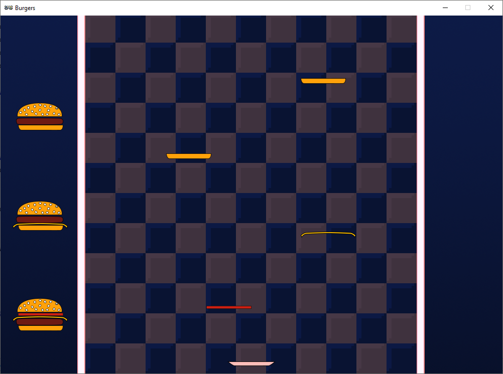
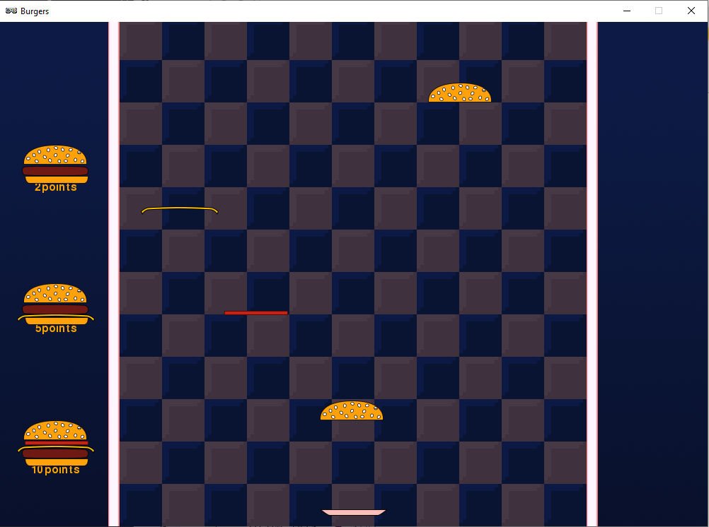
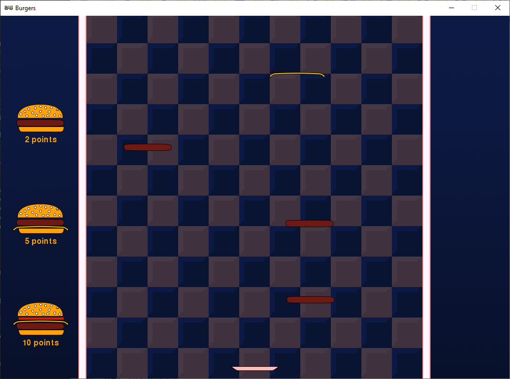
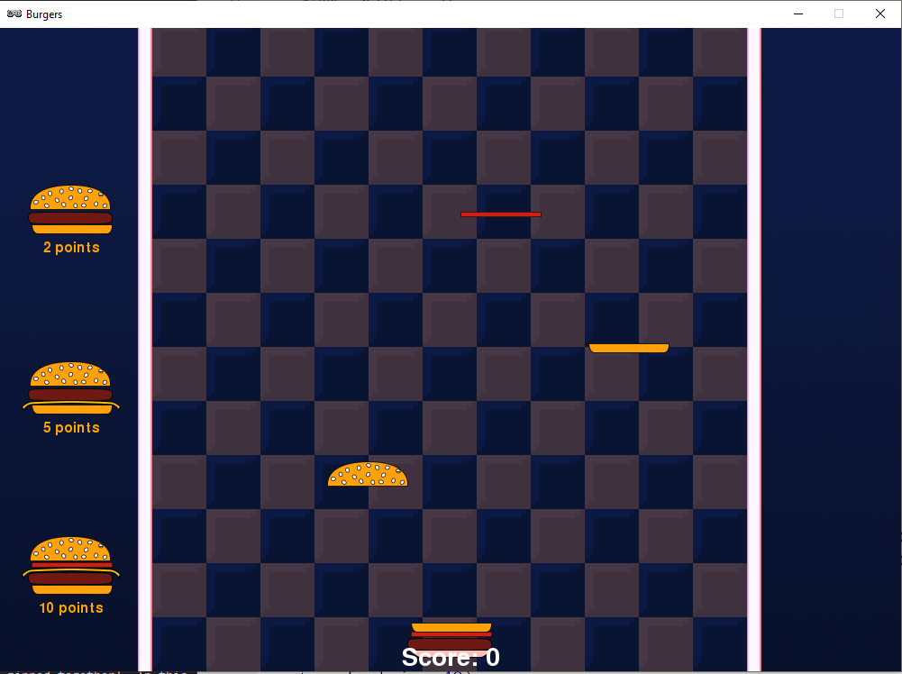

.. _part3:

.. role:: hidden
.. role:: beware

Part 3
==========================================================================

So far we've made a game about falling ingredients and catching them on a plate. In this part we'll add a scoring system so your players can earn some points for the burgers they make. 

To start with your code should look something like this:

.. code-block:: python

    import random

    TITLE = "Burgers"
    WIDTH = 1000
    HEIGHT = 714

    SPAWN_ITEM_INTERVAL = 0.5
    ITEM_X_MIN = 250
    ITEM_X_MAX = 750
    FALL_SPEED = 5

    PLATE_Y = 690
    PLATE_SPEED = 10
    CATCH_RANGE_X = 40
    CATCH_RANGE_Y = 20
    IMAGE_SIZE = 128

    NUM_ITEM_TYPES = 5
    item_images = ["burgers/bun_bottom",
                   "burgers/bun_top",
                   "burgers/meat",
                   "burgers/cheese",
                   "burgers/tomato"
                   ]
    item_heights = [11, 28, 14, 4, 6]

    class GameData:
        pass

    game = GameData()

    def start_game():
        game.items = []
        game.plate_items = []
        game.plate = Actor("burgers/plate", (WIDTH/2, PLATE_Y))
        clock.schedule(spawn_item, SPAWN_ITEM_INTERVAL)

    def draw():
        screen.blit("burgers/background",(0,0))
        for item in game.items:
            item.draw()
        game.plate.draw()
        for item in game.plate_items:
            item.draw()

    def update():
        if (keyboard[keys.A] or keyboard[keys.LEFT]):
            game.plate.x -= PLATE_SPEED
        if (keyboard[keys.D] or keyboard[keys.RIGHT]):
            game.plate.x += PLATE_SPEED
        if (game.plate.x < ITEM_X_MIN):
            game.plate.x = ITEM_X_MIN
        if (game.plate.x > ITEM_X_MAX):
            game.plate.x = ITEM_X_MAX
        for item in list(game.items):
            item.y += FALL_SPEED
            if (item.y > HEIGHT):
                game.items.remove(item)
            elif (abs(item.y - (game.plate.y - game.stack_height)) < CATCH_RANGE_Y and
                  abs(item.x - game.plate.x) < CATCH_RANGE_X):
                game.items.remove(item)
                game.plate_items.append(item)
        game.stack_height = 0
        for item in game.plate_items:
            item.y = game.plate.y - game.stack_height
            item.x = game.plate.x
            game.stack_height += item_heights[item.item_type]

    def spawn_item():
        item_type = random.randint(0, NUM_ITEM_TYPES-1)
        new_item = Actor(item_images[item_type], (random.randint(ITEM_X_MIN, ITEM_X_MAX),100))
        new_item.item_type = item_type
        game.items.append(new_item)
        clock.schedule(spawn_item, SPAWN_ITEM_INTERVAL)

    start_game()

Burger Menu
-----------

Let's draw some example burgers at the side of the screen to show people what they should be aiming to make.

Sometimes it's useful to pretend you already have a function that does what you want.  You can just go ahead and write some code that uses it. Doing this will give you a clear idea of what you need it to do when you come to write it!  

So let's pretend we have a function called :code:`draw_burger_sequence` that will draw a burger made of a sequence of ingredients at a particular place on the screen.  Add the following lines to the end of your draw function:

.. code-block:: python
    :emphasize-lines: 1,2

    draw_pos = HEIGHT-150
    draw_burger_sequence([0,2,3,4,1], 15, draw_pos)

We're pretending that :code:`draw_burger_sequence` takes three arguments: :code:`(sequence, x, y)`.   :code:`sequence` is the ingredients to draw, and :code:`x, y` is the position on the screen to draw it.

Of course, if you try to play the game now it won't work.  We need to make this new function.  Add these lines as a new function wherever you want.  A good place would be just before the :code:`draw` function.

.. code-block:: python
    :emphasize-lines: 1-4

    def draw_burger_sequence(sequence, pos_x, pos_y):
        for item_type in sequence:
            screen.blit(item_images[item_type], (pos_x, pos_y))
            pos_y -= item_heights[item_type] 

This function uses code you've seen before so it should sort of make sense to you.  The whole thing is a loop going through each item in :code:`sequence`.  :code:`screen.blit` is the same function you use to draw the background image,  all it does is draw an image at an x,y position on the screen.  So all this loop does is draw each item in the list.  The final line in the loop changes the y position by the right amount so that all the items aren't drawn in the same place.

.. image:: images/play_icon.png

Well that's one burger drawn.  Try changing the numbers in the list in your call to :code:`draw_burger_sequence` to try some different burger designs.

We really want a whole range of different burgers the player can make, not just one.  We used the sequence :code:`[0,2,3,4,1]` to define this burger, but now let's a make a list of different burger sequences.  Add this highlighted line to near the top of your file:

.. code-block:: python
    :emphasize-lines: 2

    item_heights = [11,28, 14, 4, 6]
    target_lists = [[0,2,3,4,1], [0,3,2,1], [0,2,1]]
    
The line might look a little strange to you.  That's because it's a list of lists!  Yes, a list can contain other lists!  Actually lists can contain lists of lists of lists of lists!  There's no limit to how deep you can go.  But it's rare to use more than two levels like we are doing here.  The top-level lists contains the same burger from before: :code:`[0,2,3,4,1]`, but it also contains a :code:`[0,3,2,1]` burger, and a :code:`[0,2,1]` burger. 

Let's now change the draw function to use this list of burgers.  Change the last lines of the **draw** function so they look like this:

.. code-block:: python
    :emphasize-lines: 2-4

    draw_pos = HEIGHT-150
    for sequence in target_lists:
        draw_burger_sequence(sequence, 15 ,draw_pos)
        draw_pos -= 50

Make sure you remove the old line that was calling the :code:`draw_burger_sequence` function with the hard-coded list (hard-coded means a value is specified directly in the line of code rather than using a variable). 

.. image:: images/play_icon.png

Now three burgers should appear, but it looks like they're too close together.  There is a simple change you can make to fix this.  Can you figure out what it is?

| Select this box with your mouse to see the answer:
| :hidden:`Change "draw_pos -= 50" to "draw_pos -= 200"`

Pointless
---------

OK, so now we have target burgers.  Next, we should add some text beneath each one to say how many points it is worth.  First, add this line to near the top of the file to represent how many points each type of burger is worth:

.. code-block:: python
    :emphasize-lines: 3

    item_heights = [11,28, 14, 4, 6]
    target_lists = [[0,2,3,4,1], [0,3,2,1], [0,2,1]]
    target_points = [10, 5, 2]

Now let's change the :code:`draw_burger_sequence` function so that it also displays the number of points for each burger.  Make the changes in the highlighted lines below:

.. code-block:: python
    :emphasize-lines: 1-5

    def draw_burger_sequence(sequence, pos_x, pos_y, points):
        screen.draw.text("{0}points".format(points),
          centerx = pos_x + IMAGE_SIZE/2, 
          centery = pos_y + 70, 
          color="orange")
        for item_type in sequence:
            screen.blit(item_images[item_type], (pos_x, pos_y))
            pos_y -= item_heights[item_type] 

We added a new line and we also changed the function signature so that it takes new parameter, :code:`points`.   We used the :code:`screen.draw.text` function in Flappy Bird. Do you remember what each parameter in does?

If you try playing the game now, you'll see that we get this error message:

.. code-block:: python

    TypeError: draw_burger_sequence() missing 1 required positional argument: 'points'

That's because we added a new parameter :code:`points` to our :code:`draw_burger_sequence` function, but we forgot to add a :code:`points` argument when we call it in the :code:`draw` function.  Make the end of your draw function look like this:

.. code-block:: python
    :emphasize-lines: 2-4

    draw_pos = HEIGHT-150
    for sequence, points in zip(target_lists, target_points):
        draw_burger_sequence(sequence, 15 ,draw_pos, points)
        draw_pos -= 200

Here we're using the **zip** function.  It's a function that's built into Python and we can use it to loop through two different lists at the same time.  It's like the two lists get zipped together!  

In this code we're looping through :code:`target_lists` and :code:`target_points` at the same time. :code:`sequence` and :code:`points` are variables that represent each item in the lists as we go through them.  :code:`sequence` is the first variable, so it takes values from the first list in the zip, and :code:`points` is the second so it takes values from the second list, :code:`target_points`.

.. image:: images/play_icon.png

Well the points are there, but it looks like we have a couple of problems.  The points are slightly hidden behind the burgers, and there is no space between the number, and the word "points".  Can you fix these two issues?  This is how we want it to look:   

| Select these boxes with your mouse to see the first solution to the first problem:

| :hidden:`Find this line: centery = pos_y + 70`
| :hidden:`and change the 70 to 80`

| Select these boxes with your mouse to see the solution to the second problem:

| :hidden:`Find this line: screen.draw.text("{0}points".format(points),`
| :hidden:`and add a space between the {0} and points`

What's the score?
-----------------

Great, now we have some burger targets to aim for.  It would be good if we could actually earn those points!

First let's create a score variable to keep track of how many points the player has earned so far.  Add this line to your **start_game** function:

.. code-block:: python
    :emphasize-lines: 2

    def start_game():
        game.score = 0
        game.items = []

Now let's add a line to the end of the **draw** function to print this score on the screen.  Make sure you indent it correctly so that it's in the function but not inside the loop you already have at the end of the function.

.. code-block:: python
    :emphasize-lines: 1-4

    screen.draw.text("Score: {0}".format(game.score),
                     centerx = WIDTH/2,
                     bottom = HEIGHT, 
                     fontsize=40)

.. image:: images/play_icon.png

Now we have the score on the screen.  But it doesn't actually change yet, we need to do that next. But first we should fix the way the plate and the score overlap.  Can you figure out a way to fix them?   

Try to fix this now.  If you get stuck just leave it for now and we'll come back to it later.

Finally getting to the point
----------------------------

Ok, so let's actually give the player some points.  We're going to compare the list of items currently on the plate to each of the target sequences.  We have the :code:`game.plate_items` list, but this is a list of Actor objects, and each target sequence is a list of numbers.  There are ways we could convert the Actor list to a number list, but to keep things simple we'll make another list to keep track of what's on the plate, but this new list will store numbers.

This new list will be called :code:`game.plate_item_types`.  Let's add this to **start_game**:

.. code-block:: python
    :emphasize-lines: 5

    def start_game():
        game.score = 0
        game.items = []
        game.plate_items = []
        game.plate_item_types = []
        game.plate = Actor("burgers/plate", (WIDTH/2, PLATE_Y))

Then we need to add to this list when we catch an item.  Add the following line to the item loop in your **update** function.

.. code-block:: python
    :emphasize-lines: 9

    for item in list(game.items):
        item.y += FALL_SPEED
        if (item.y > HEIGHT):
            game.items.remove(item)
        elif (abs(item.y - (game.plate.y - game.stack_height)) < CATCH_RANGE_Y and
              abs(item.x - game.plate.x) < CATCH_RANGE_X):
            game.items.remove(item)
            game.plate_items.append(item)
            game.plate_item_types.append(item.item_type)

Notice how it's very similar to the line before it, except instead of adding :code:`item` (which is the Actor), we add :code:`item.item_type`, which is the number representing what type of item it is.

Now that we have this list, we need to compare it to the target sequences to see if the player has made one of the target burgers. Let's add a new function to check for matches.  Add this new function wherever you like, as long as it's not inside another function.

.. code-block:: python
    :emphasize-lines: 1-6

    def check_for_target_burgers():
        for sequence, points in zip(target_lists, target_points):
            if (game.plate_item_types == sequence):
                game.score += points
                game.plate_items = []
                game.plate_item_types = []

We're using the zip function again to iterate (loop) through two lists at the same time.  If we find a match then we increase the players score the right number of points and then empty the plate by setting both of our item lists back to empty lists.

Now we need to actually call this function somewhere. We could put the check anywhere in the **update** function, but this is a bit wasteful.  Most of the time there's no need to check because nothing has changed. If we want to be efficient we could just only do the check when a new item is caught.

Find the code in the update function where we catch items and add the highlighted line:

.. code-block:: python
    :emphasize-lines: 10

    for item in list(game.items):
        item.y += FALL_SPEED
        if (item.y > HEIGHT):
            game.items.remove(item)
        elif (abs(item.y - (game.plate.y - game.stack_height)) < CATCH_RANGE_Y and
              abs(item.x - game.plate.x) < CATCH_RANGE_X):
            game.items.remove(item)
            game.plate_items.append(item)
            game.plate_item_types.append(item.item_type)
            check_for_target_burgers()

.. image:: images/play_icon.png

You should now be able to score points. But you've probably noticed that if your burger goes wrong it's impossible to get rid of it!  We'll look at ways to fix this in part 4, but for now let's do a simple fix.  We'll make it so that when you press the escape key on your keyboard the plate is cleared.  Add this function:

.. code-block:: python
    :emphasize-lines: 1-4

    def on_key_down(key):
        if (key == keys.ESCAPE):
            game.plate_items=[]
            game.plate_item_types = []

.. image:: images/play_icon.png

Now if your burger goes wrong you can press escape to reset your plate.

Stop the plate overlapping the score
------------------------------------
Finally, as promised here are some ways to stop the plate overlapping the score.  If you've already found your own fix you can ignore this section.  I'm going to show two different ways to fix it:

Solution 1: Move the score to the top of the screen
^^^^^^^^^^^^^^^^^^^^^^^^^^^^^^^^^^^^^^^^^^^^^^^^^^^^^^^^^
To put the score at the top of the screen just change the y value used in the call to :code:`screen.draw.text` in the **draw** function.  This function actually allows a few different parameters to specify the y value,  currently we're using :code:`bottom = HEIGHT` to put the bottom of the text on the bottom of the screen.  To position it 10 pixels below the top of the screen we can make the following change to the **draw** function:

.. code-block:: python
    :emphasize-lines: 3

    screen.draw.text("Score: {0}".format(game.score), 
        centerx = WIDTH/2, 
        top = 10, 
        fontsize=40)

Solution 2:  Move the plate up a bit
^^^^^^^^^^^^^^^^^^^^^^^^^^^^^^^^^^^^^^^^^^^^^^^^^^^^^^^^^
We already have a constant which defines the y position of the plate.  If we want to move the plate higher all we need to do is change that value:

.. code-block:: python
    :emphasize-lines: 1

    PLATE_Y = 670

Coming up in Part 4
-------------------

In part 4 we will add an intro screen and a final score screen.  We'll add a better solution for what happens when your burger goes wrong, and we'll also fix a problem you might have noticed, that sometimes you need to wait a long time for the ingredient you need.

