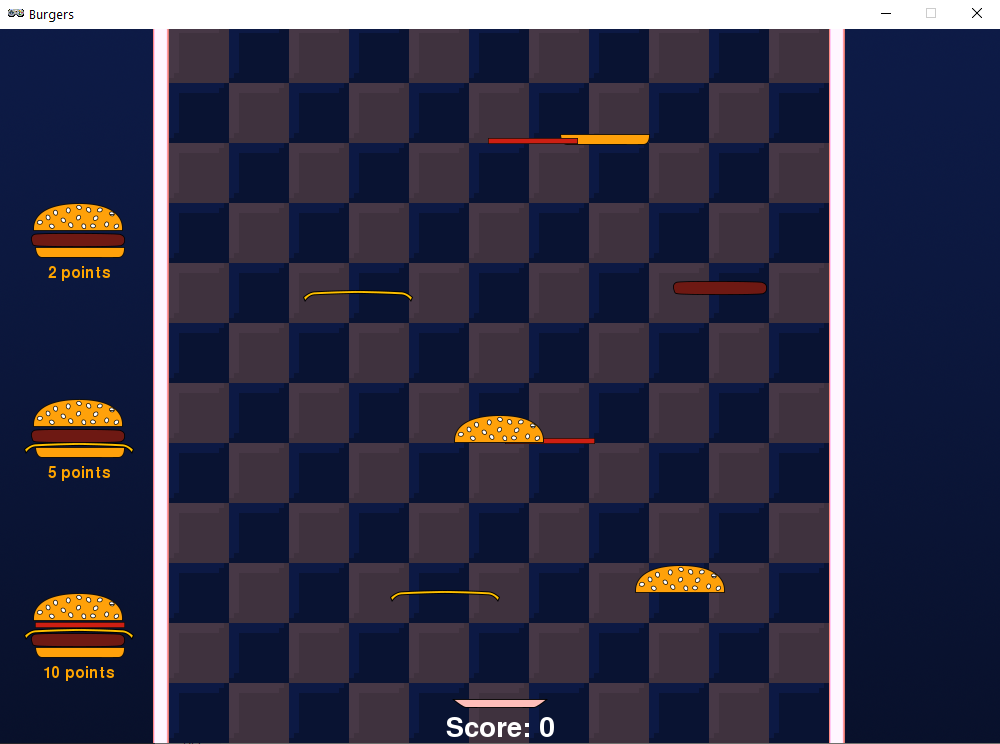

.. _part4:

.. role:: tip
.. role:: hidden
.. role:: beware

Part 4
==========================================================================
We've already built the core of the game.  In this final part we'll be adding a few finishing touches like a start screen and an end screen.  We'll also fix a few annoying little issues.

To start with your code should look something like this:

.. code-block:: python

    import random

    TITLE = "Burgers"
    WIDTH = 1000
    HEIGHT = 714

    SPAWN_ITEM_INTERVAL = 0.5
    ITEM_X_MIN = 250
    ITEM_X_MAX = 750
    FALL_SPEED = 5

    PLATE_Y = 670
    PLATE_SPEED = 10
    CATCH_RANGE_X = 40
    CATCH_RANGE_Y = 20
    IMAGE_SIZE = 128

    NUM_ITEM_TYPES = 5
    item_images = ["burgers/bun_bottom",
                   "burgers/bun_top",
                   "burgers/meat",
                   "burgers/cheese",
                   "burgers/tomato"
                   ]
                   
    item_heights = [11, 28, 14, 4, 6]
    target_lists = [[0,2,3,4,1], [0,3,2,1], [0,2,1]]
    target_points = [10, 5, 2]

    class GameData:
        pass

    game = GameData()

    def start_game():
        game.score = 0
        game.items = []
        game.plate_items = []
        game.plate_item_types = []
        game.plate = Actor("burgers/plate", (WIDTH/2, PLATE_Y))
        clock.schedule(spawn_item, SPAWN_ITEM_INTERVAL)

    def draw_burger_sequence(sequence, pos_x, pos_y, points):
        screen.draw.text("{0} points".format(points),
          centerx = pos_x + IMAGE_SIZE/2,
          centery = pos_y + 80,
          color="orange")
        for item_type in sequence:
            screen.blit(item_images[item_type], (pos_x, pos_y))
            pos_y -= item_heights[item_type]

    def draw():
        screen.blit("burgers/background",(0,0))
        for item in game.items:
            item.draw()
        game.plate.draw()
        for item in game.plate_items:
            item.draw()
        draw_pos = HEIGHT-150
        for sequence, points in zip(target_lists, target_points):
            draw_burger_sequence(sequence, 15 ,draw_pos, points)
            draw_pos -= 200
        screen.draw.text("Score: {0}".format(game.score),
                     centerx = WIDTH/2,
                     bottom = HEIGHT,
                     fontsize=40)
                     
    def check_for_target_burgers():
        for sequence, points in zip(target_lists, target_points):
            if (game.plate_item_types == sequence):
                game.score += points
                game.plate_items = []
                game.plate_item_types = []
                
    def update():
        if (keyboard[keys.A] or keyboard[keys.LEFT]):
            game.plate.x -= PLATE_SPEED
        if (keyboard[keys.D] or keyboard[keys.RIGHT]):
            game.plate.x += PLATE_SPEED
        if (game.plate.x < ITEM_X_MIN):
            game.plate.x = ITEM_X_MIN
        if (game.plate.x > ITEM_X_MAX):
            game.plate.x = ITEM_X_MAX
        for item in list(game.items):
            item.y += FALL_SPEED
            if (item.y > HEIGHT):
                game.items.remove(item)
            elif (abs(item.y - (game.plate.y - game.stack_height)) < CATCH_RANGE_Y and
                  abs(item.x - game.plate.x) < CATCH_RANGE_X):
                game.items.remove(item)
                game.plate_items.append(item)
                game.plate_item_types.append(item.item_type)
                check_for_target_burgers()
        game.stack_height = 0
        for item in game.plate_items:
            item.y = game.plate.y - game.stack_height
            item.x = game.plate.x
            game.stack_height += item_heights[item.item_type]

    def on_key_down(key):
        if (key == keys.ESCAPE):
            game.plate_items=[]
            game.plate_item_types = []

    def spawn_item():
        item_type = random.randint(0, NUM_ITEM_TYPES-1)
        new_item = Actor(item_images[item_type], (random.randint(ITEM_X_MIN, ITEM_X_MAX),100))
        new_item.item_type = item_type
        game.items.append(new_item)
        clock.schedule(spawn_item, SPAWN_ITEM_INTERVAL)

    start_game()

Any burger is better than nothing
---------------------------------

So far your players have to make exactly the right kind of burger to get any points.  But don't you think they should get at least one point for finishing a burger even if it doesn't match?  We should at least clear the plate when they make a non-matching burger, so that the plate is clear for the next burger. Also, we could make things easier for the player by only allowing the bun bottom to be the first item on the plate.  That means that sooner or later they will make a complete burger of some kind.

First, let's make it so that an empty plate will ignore all ingredients apart from the bun bottom.  We're going to modify this **elif** statement from our **update** function.  The line is highlighted below, but there are no changes yet.   What could we add to this elif statement so that it's only **true** when either the plate isn't empty, or if the item to catch is a bun bottom?

.. code-block:: python
    :emphasize-lines: 5-6

    for item in list(game.items):
        item.y += FALL_SPEED
        if (item.y > HEIGHT):
            game.items.remove(item)
        elif (abs(item.y - (game.plate.y - game.stack_height)) < CATCH_RANGE_Y and
              abs(item.x - game.plate.x) < CATCH_RANGE_X):
            game.items.remove(item)
            game.plate_items.append(item)
            game.plate_item_types.append(item.item_type)
            check_for_target_burgers()

We'll see the solution in a minute.  But before we go on let's add a couple of convenient constants to the top of our file.  Add these lines:

.. code-block:: python
    :emphasize-lines: 7-8

    item_images = ["burgers/bun_bottom",
    "burgers/bun_top",
    "burgers/meat",
    "burgers/cheese",
    "burgers/tomato"
    ]
    BUN_BOTTOM = 0
    BUN_TOP = 1

These two numbers are an easy way to refer to these two special ingredients.  The numbers match the position of these ingredients in the image array.  The bun bottom is first (number 0) and the bun top is second (number 1).  Remember that array numbering starts at zero!

Now let's think about the two things we need to check:
 - If the plate isn't empty
 - If the item in the catching zone in a bun bottom

Checking if the plate isn't empty is easy.  We store the items on the plate in a list called :code:`game.plate_items`,  and we can get the length of this list with :code:`len(game.plate_items)`.  If the length is greater than zero then there is something on the plate!

Checking if the item we're catching is a bun bottom is now as simple as seeing if :code:`item.item_type` is equal to :code:`BUN_BOTTOM`.

See if you can use these two ideas to modify the **elif** statement highlighted above.  Remember the aim is that the plate won't catch any other items until it has a bun bottom.

Hint : You might need to put () around part of the code to make sure the **and** and **or** keywords happen in the right order.

Scroll down to see the solution

...

...

...

...

...
 

...

...
 

...

...
 

...

Here's the solution:

.. code-block:: python
    :emphasize-lines: 5-7

    for item in list(game.items):
        item.y += FALL_SPEED
        if (item.y > HEIGHT):
            game.items.remove(item)
        elif (abs(item.y - (game.plate.y - game.stack_height)) < CATCH_RANGE_Y and
              abs(item.x - game.plate.x) < CATCH_RANGE_X and
              (len(game.plate_items) > 0 or item.item_type == BUN_BOTTOM)):
            game.items.remove(item)
            game.plate_items.append(item)
            game.plate_item_types.append(item.item_type)
            check_for_target_burgers()

.. image:: images/play_icon.png

Great, now we can only catch a bun bottom as the first ingredient.  Now let's detect when a burger is finished even if it wasn't one of the target burgers.  We need to detect when the last item in the :code:`game.plate_items` list is :code:`BUN_TOP`.  We can check the first item in a list using :code:`[0]`, but how can we check the last item in the list?  Python has a funky feature for getting the last item in a list, to get the last item in :code:`game.plate_items` you can type :code:`game.plate_items[-1]`.   -1 means the last item, -2 means the second last item and so on.  That means we can do:

.. code-block:: python
    :emphasize-lines: 7-11

    def check_for_target_burgers():
    for sequence, points in zip(target_lists, target_points):
        if (game.plate_item_types == sequence):
            game.score += points
            game.plate_items = []
            game.plate_item_types = []
            return
    if (game.plate_item_types[-1] == BUN_TOP):
        game.score += 1
        game.plate_item_types = []
        game.plate_items = []

This new **if** statement checks for the bun top, then gives the player 1 point and clears the plate.  

Can you see why we needed to add the return statement at the end of the **if** inside the loop? 

There are couple of ways to improve this function:

- Make a constant at the top of the file to define how many points a non-matching burger is worth. Use that instead of the hard-coded :code:`1` to reward the player.  For example you could call it :code:`NON_MATCHING_BURGER_POINTS`.

- Can you rearrange the code so that the code to clear the plate isn't duplicated?  One way to do it would be to make a new :code:`ClearPlate` function.

Too hungry to wait
------------------

Have you noticed that some times you have to wait a really long time to get the ingredient that you want?  It's up to you as the game designer, but I find this quite annoying.  Luckily there's an easy way to make it better!

Imagine rolling a die and trying to get a 6.  Who knows how long it could take?  You might never roll a 6!  Now imagine 6 cards numbered from 1 to 6, shuffled and placed face down in a pile.  If you pick them up, one at a time, trying to get a 6, how long will it take?  Even if you're really unlucky you're guaranteed to get one after 6 tries at the most, because by then you will have taken the whole pile!

This is what we'll do for burger ingredients.  We can make a list of ingredient to put in our "deck of cards".  Add this line:

.. code-block:: python
    :emphasize-lines: 7

    item_images = ["burgers/bun_bottom",
                    "burgers/bun_top",
                    "burgers/meat",
                    "burgers/cheese",
                    "burgers/tomato"
    ]
    random_item_list = [0,1,2,3,4]

Each number in the list corresponds an item in the :code:`item_images` list.  Now let's make a new list to store a shuffled version of this list:

.. code-block:: python
    :emphasize-lines: 2-3

    def start_game():
        game.queued_items = random_item_list[:]
        random.shuffle(game.queued_items)
        game.score = 0

This makes a copy of our list and then shuffles it up.  The :code:`[:]` here is very important.  It tells python to make a copy of the list.  If we had just done this:

.. code-block:: python

        game.queued_items = random_item_list   #Not using [:] 

Then :code:`game.queued_items` would be a different name for the same list!  This might not sound like a big deal, but soon we're going to start removing items from :code:`game.queued_items`, and if we had done it this way then that would mean that we would also be removing items from :code:`random_item_list` at the same time.  We don't want that to happen because we need that list to fill :code:`game.queued_items` back up again when it's empty.

:tip:`If you write Python code for long then sooner or later you're going to have a bug where you thought you had two different lists, but really you just had two different names for the same list.  Using [:] to make a copy of a list is often the way to fix it!`

So now let's change the **spawn_item** function so it uses the shuffled items from :code:`queued_items` instead of picking completely random items.

.. code-block:: python
    :emphasize-lines: 2-5

    def spawn_item():
        if (len(game.queued_items) == 0):
            game.queued_items = random_item_list[:]
            random.shuffle(game.queued_items)
        item_type = game.queued_items.pop()
        new_item = Actor(item_images[item_type], (random.randint(ITEM_X_MIN, ITEM_X_MAX),100))

:beware:`Make sure` you remove the old :code:`item_type = random.randint(0, NUM_ITEM_TYPES-1)` line!

Did you notice the **pop** function in the code we just added?  This is another built-in Python feature that gives you (returns) the last item from a list and *also removes that item from this list*.   We also added some code at the beginning of the function that checks to see if the :code:`game.queued_items` list is now empty, and if it is then it repopulates the list by doing another copy and shuffle.

.. image:: images/play_icon.png

Great!  Now it should be far more rare to see the same item coming twice in a row, and you'll never have to wait very long for any item.  Here's a puzzle:  what's the biggest number of non-cheese ingredients you would ever have to skip past to get a piece of cheese?

| Select this box with your mouse to see the answer:
| :hidden:`8 items.  There are 5 items that get shuffled and spawned in order. If the first item in the shuffled list was cheese and you just missed it you would have to skip past the other 4 in the list.  Then, the list would be shuffled again, and if you got really unlucky this time the cheese would be at the end of the list.  So you would have to wait past another 4 non-cheese items before you got to it.`

Here are a few more things to think about:

- Is it still possible to see the same item twice in a row?  Why?

- Did we really need to add code to the :code:`start_game` function to make this work?

- What would happen if we changed the line that creates :code:`random_item_list` to this:

.. code-block:: python
    
    random_item_list = [0,1,2,3,3,3,3,3,3,3,3,3,3,3,3,3,3,3,3,3,3,3,3,3,3,3,3,3,4]

Feel free to talk to a mentor about these questions.

What if the game itself was a burger?
-------------------------------------

So far this game is all meat, but most games have a beginning and an end.   Just like a burger needs a bun to hold it together, our game also needs a beginning and an end to complete the package.

First we'll add a simple intro screen,  add this new function that will draw the intro screen:

.. code-block:: python
    :emphasize-lines: 1-6

    def draw_before_game():
        screen.clear()          
        screen.draw.text("Press Space To Start", 
                         centerx = WIDTH/2, 
                         centery = HEIGHT/2,
                         color="white")

Then rename our old **draw** function to indicate that it's for drawing the game (and not the intro screen):

.. code-block:: python
    :emphasize-lines: 1

    def draw_game():
        screen.blit("burgers/background",(0,0))
        for item in game.items:
            item.draw()
            game.plate.draw()

But PyGame needs there to be a **draw** function.  So let's add one back in.  We'll make the new one choose which of our specialized draw functions it should use, but for now let's just make it call the intro one.

Add this new function:

.. code-block:: python
    :emphasize-lines: 1-2

    def draw():
        draw_before_game()

.. image:: images/play_icon.png

We can now see an intro screen, but there's no way get past the intro.  We need to add a variable to keep track of which part of the game we're in.  Let's add a few special constants to represent different stages of the game:

.. code-block:: python
    :emphasize-lines: 5-7

    TITLE = "Burgers"
    WIDTH = 1000
    HEIGHT = 1000

    BEFORE_GAME = 0
    IN_GAME     = 1
    AFTER_GAME  = 2

And we'll add a new variable to keep track of which stage we're in:

.. code-block:: python
    :emphasize-lines: 4

    class GameData:
        pass

    game = GameData()
    game.state = BEFORE_GAME

If you're wondering why we set this variable here at the top of file instead of in the :code:`start_game` function you'll find out later.

Now let's update that new **draw** function we added so that it calls different versions of the function depending on which stage of the game we're in:

.. code-block:: python
    :emphasize-lines: 2-7

    def draw():
        if (game.state == BEFORE_GAME):
            draw_before_game()
        elif (game.state == IN_GAME):
            draw_game()
        else: 
            draw_after_game()

Everything should still work the same still, but let's test to make sure:

.. image:: images/play_icon.png

Now we need to do the same thing for the **update** function.  We'll rename the function we already have to :code:`update_game`:

.. code-block:: python
    :emphasize-lines: 1
    
    def update_game():
        if (keyboard[keys.A] or keyboard[keys.LEFT]):
            game.plate.x -= PLATE_SPEED

Then we'll add a new **update** function that will call the right version depending on what stage we're in:

.. code-block:: python
    :emphasize-lines: 1-7

    def update():
        if (game.state == BEFORE_GAME):
            update_before_game()
        elif (game.state == IN_GAME):
            update_game()
        elif (game.state == AFTER_GAME):
            update_after_game()

Then we'll add the :code:`update_before_game` version.  All it needs to do is wait for the space key to be pressed and then change the stage.  Add this function somewhere near the **update** function:

.. code-block:: python
    :emphasize-lines: 1-4

    def update_before_game():
        if (keyboard[keys.SPACE]):
            game.state = IN_GAME
            start_game()

.. image:: images/play_icon.png

Oops something weird happened!  It looks like there are too many ingredients coming down.  This is because we actually called the :code:`start_game` function twice!  Can you see how?

That's right, we still have a call to :code:`start_game` at the end of the file.  We don't need that any more, we just need the one that happens in the :code:`update_before_game` function.  Go ahead and remove the line at the end of the file that looks like this:

.. code-block:: python

    start_game()

.. image:: images/play_icon.png

Now things should be back to normal and we can see that our intro screen is working correctly!

Next we'll add an end screen.  First we need to decide when the game should end.  Let's say that it ends after a certain number of ingredients have fallen.  We'll make it 10 for now so it doesn't take a long time to test, and then when we're done we can put it up to something higher like 100.  Add this constant near the top of your file:

.. code-block:: python
    :emphasize-lines: 1

    NUM_ITEMS_IN_LEVEL = 10 #TODO change to 100 when game is finished

Programmers often leave themselves "TODO" notes in comments for things they need to do later.  (Remember that everything after a # is called a comment and is ignored by Python)

Then we can add a variable to track how many items we've spawned so far. While we're looking at the function we'll also add in a variable to track when we've triggered the end of the game.  You'll see why we need this later.

.. code-block:: python
    :emphasize-lines: 2-3

    def start_game():
        game.spawned_item_count = 0
        game.game_end_triggered = False
        game.queued_items = random_item_list[:]

We'll make this number go up everytime we spawn an item.  We'll also make it so that we stop spawning items when we've done enough.  Make this change to the end of the **spawn_item** function:

.. code-block:: python
    :emphasize-lines: 3-5

    new_item.item_type = item_type
    game.items.append(new_item)
    game.spawned_item_count += 1
    if(game.spawned_item_count < NUM_ITEMS_IN_LEVEL):
        clock.schedule(spawn_item, SPAWN_ITEM_INTERVAL)

Remember that the only reason the :code:`spawn_item` function keeps getting called is because of the :code:`clock.schedule` call which schedules the function to be be called again.  Now once we spawned all the items we don't schedule another call.

.. image:: images/play_icon.png

Now you should only see 10 items fall and no more!

We could make the game end once we've spawned the last item.  But it would look more natural if the last few items were allowed to drift down the screen before the game ends.  So that's what we'll do!  Let's add some code to the end of the **update_game** function to check for when all the items are gone:

.. code-block:: python
    :emphasize-lines: 6-7

    for item in game.plate_items:
        item.y = game.plate.y - game.stack_height
        item.x = game.plate.x
        game.stack_height += item_heights[item.item_type]

    if (game.spawned_item_count >= NUM_ITEMS_IN_LEVEL and len(game.items) == 0 ):
        game.state = AFTER_GAME

.. image:: images/play_icon.png

If you play now you should see the game does end after 10 items, but not the way we would like!  The game crashes!  

You might have already figured out why.  We wrote code in our :code:`update` and :code:`draw` functions that calls special after-the-game versions of those functions but we didn't ever define them! Let's add these functions now:

.. code-block:: python
    :emphasize-lines: 1-9

    def draw_after_game():
        screen.clear()
        screen.draw.text("Final Score = " + str(game.score), centerx = WIDTH/2, centery = 1/3 * HEIGHT,color="white", fontsize=80)
        screen.draw.text("Press Space To Start Again", centerx = WIDTH/2, centery = 2/3 *  HEIGHT,color="white", fontsize=80)

    def update_after_game():
        if (keyboard[keys.SPACE]):
            game.state = IN_GAME
            start_game()

You should be able to see what these two functions do.  The :code:`draw_after_game` function draws a couple of messages on the screen, and the :code:`update_after_game` function waits for the player to press space then it starts the game again.

.. image:: images/play_icon.png

You should now see a working final score screen!

One final tweak
---------------

You might have noticed that the game can end very suddenly, especially if you finish a burger with that very last ingredient.  Our finishing touch as programmers on this game will be to add a few seconds of delay after the end of the game before showing the final score.

Change the *if* at the end of the **update_game** function to this:

.. code-block:: python
    :emphasize-lines: 1-4

    if (game.spawned_item_count >= NUM_ITEMS_IN_LEVEL and len(game.items) == 0
        and game.game_end_triggered == False):
        clock.schedule(end_game, 2)
        game.game_end_triggered = True

and, of course, add the new function:

.. code-block:: python
    :emphasize-lines: 1-2

    def end_game():
        game.state = AFTER_GAME

.. image:: images/play_icon.png

You should now have a nice little pause at the end of the game before the final score screen is displayed.  These little details can make a big difference to how much people enjoy your game!

Can you see why we needed the :code:`game.game_end_triggered`?  

We need the :code:`game.game_end_triggered` variable to make sure we don't schedule more than one call to the :code:`end_game` function.

* If you want to find out what happens, just remove the :code:`game.game_end_triggered = True` line, and you'll see that some very strange stuff happens! (To make the strange things happen you need to finsh one game, then quickly press space to start the game again)

Finally, let's put the number of items in the game up to 100 like we said we would:

.. code-block:: python
    :emphasize-lines: 5

    BEFORE_GAME = 0
    IN_GAME     = 1
    AFTER_GAME  = 2

    NUM_ITEMS_IN_LEVEL = 100

And the game is finished!   See how many points you can get!

.. image:: images/play_icon.png

This was a big project - our code file is nearly 200 lines long!    Congratulations on making it to the end! 

If you feel like extending the game here are a few ideas for things you could try:

- Add some new target burger designs
- Add a new ingredient - maybe lettuce, some mustard or why not go crazy and add some M&Ms!
- Make it so that instead of targets designs the player just gets points the ingredients in the burger. E.g. meat is worth 5 points, cheese is worth 2, et.  But they only get the points once the bun top goes on
- Make it so that the player can move the plate up and down as well as side to side
- Make the aim of the game to make one of each target burger, and the goal is to do it as quickly as possible
- Make it so that player gets one point for every different burger they make, and instead of having a time limit, the game ends if you accidentally make a burger you made before.  

Don't forget you can ask a mentor for help with any of these ideas.  If you have your own ideas for how to improve the game then that's even better!

